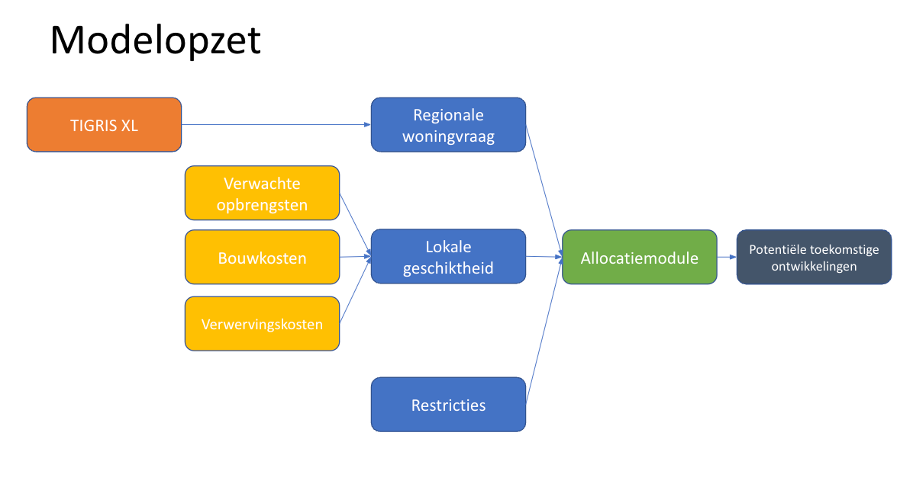
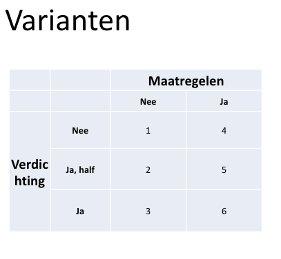

# Geschikte bouwgrond in Nederland

Dit is de repository met data, code en verantwoording over methodologie voor het verhaal XXX van Follow the Money en Cobouw. 

De data en modellering zijn geleverd door Jip Claassens en Eric Koomen van de Vrije Universiteit. Het gebruikte model is ontwikkeld in opdracht van het Planbureau voor de Leefomgeving, maar dit instituut is verder niet betrokken bij dit onderzoek.

## Centrale vraag

Wat zijn tot 2030 de meest geschikte plekken in Nederland om honderdduizenden woningen te bouwen?

## Subvragen

1. Hoe bepaal je wat een geschikte plek is om woningen te bouwen? 
2. Wat zijn, uitgaande van verschillende scenario’s, de beste plekken om te bouwen?
3. Hoe verhouden die resultaten zich tot de huidige bouwplannen en het grondbezit van de grootste bouwbedrijven en projectontwikkelaars?

## Waarom is dit belangrijk?

Wat een goede plek is, hangt af van wat je belangrijk vindt. Keuzes die je maakt, kunnen lokaal grote invloed hebben op waar je het beste nieuwe huizen kunt bouwen. Die keuzes worden nu al gemaakt voor de komende jaren. Die keuzes bepalen dus hoe jouw omgeving eruit ziet. Die keuzes zijn behalve technisch dus ook politiek. En we maken voor het eerst op lokaal niveau inzichtelijk wat de gevolgen zijn van verschillende keuzes waar je mogelijk het beste huizen kunt bouwen.

## Wat zijn de beperkingen van ons onderzoek?

Uiteindelijk is het maar een model waarin weliswaar veel, maar ook een begrensd aantal factoren worden meegewogen en allerlei aannames zitten. Vooral op lokaal niveau kunnen er allerlei beperkingen of juist kansen zitten die niet zijn meegewogen.

## Het model en de data

We hebben gebruik gemaakt van de RuimteScanner, dat in opdracht van het Planbureau voor de Leefomgeving ontwikkeld is door de Vrije Universiteit. Op de [site van het SPINLab](Redirecting you to https://spinlab.vu.nl/research/spatial-analysis-modelling/land-use-scanner-model/) lees je meer over het model. 



### Woningvraag

Als referentiescenario voor de regionale woningvraag is de Toekomstverkenning Welvaart en Leefomgeving (WLO) gebruikt maar daarin het scenario 'hoog' (relatief hoge groei van de bevolking en de economie). Met het [model TIGRIS-XL](https://www.pbl.nl/publicaties/naar-een-nieuw-tigris-xl) is per gemeente de woningvraag ingeschat tot 2030. In totaal gaat het om 808.000 woningen.

### Lokale geschiktheid

Vervolgens is gekeken naar lokale geschiktheid. Dat weerspiegelt per grid cell van 100 x 100 meter de verwachte opbrengsten, bouwkosten, grondproductiekosten en verwervingskosten huidige opstal. Die kosten zijn gebaseerd op onderzoek van het SPINLab naar woningprijzen en de data van het [Bouwkostenkompas](https://www.bouwkostenkompas.nl/nl). 

### Restricties

Voor het inschatten van de restricties voor bouw is gekeken naar omgevingsrechtelijke factoren zoals:
1. EU: Natura2000-gebieden
2. AMvB's (Algemene Maatregel van Bestuur): militaire terreinen, kustfundamenten, munitieopslag, weidevogelkansgebieden, bijzonder provinciale landschappen, Hollandse waterlinie, rivierbeddingen, etc.
3. Provinciale Milieu Verordeningen: grondwaterbeschermingsgebieden, waterwingebieden, stiltegebieden.
4. BEVI (Besluit Externe Veiligheid Inrichtingen): Inrichtingen en installateis uit het Register Risicosituaties Gevaarlijke Stoffen. 

Andere restricties zijn gebieden die reeds benut zijn en waarvan de bestemming niet makkelijk veranderd kan worden, bijvoorbeeld water, grote infrastructuur, begraafplaatsen, parken en gebieden met delfstoffenwinning. 

### Klimaatmaatregelen

Vervolgens is gekeken naar geschikte grond waarbij rekening wordt gehouden met klimaatmaatregelen. De aanname is dat slappe, natte, zettingsgevoelige grond en grond die in overstromingsgebieden liggen minder geschikt zijn voor woningbouw. Voor meer informatie over de categorieën te slap, te nat, te zettingsgevoelig en overstromingsrisico verwijzen we je door naar [dit essay](https://klimaatadaptatienederland.nl/@249379/essay-op-waterbasis/) geschreven in opdracht van Deltares.

### Scenario's

Er zijn zes scenario's doorgerekend langs twee assen. 

De eerste as is de mate van verdichting, dus hoeveel huizen binnen de begrenzing van bebouwd gebied worden neergezet. Hierbij is de vastgestelde mate van verdichting in de periode 2012-2022 als uitgangspunt genomen. Dit is vastgesteld op basis van de BAG en data van VROM. Er zijn drie varianten doorgerekend:
1. Er vindt geen verdere verdichting plaats.
2. De verdichting wordt voor 50 procent doorgezet.
3. De huidige trend van verdichting wordt voortgezet.

De tweede as zijn de klimaatmaatregelen, dus dat bij voorkeur niet gebouwd wordt in overstromingsgebieden of op grond die te nat, slap of zettingsgevoelig is. 

In dit overzicht zie je de scenario's:



## Data en repliceerbaarheid

Zelf aan de slag? Dat is heel eenvoudig. Clone de repository. Zorg dat je [Docker](https://docs.docker.com/) hebt draaien. Typ het volgende in de root van je geclonede repository.

```

docker-compose up -d

```

De eerste keer duurt het even voordat alles is geïnstalleerd. Je kunt op localhost:8888 vervolgens Jupyter Lab opstarten. 

Ben je klaar, typ dan 

```

docker-compose down

```

om de docker containers uit te zetten. Ben je helemaal klaar typ dan

```

docker-compose down -v

```

om alle volumes te verwijderen.

Zie de [Docker documentatie](https://docs.docker.com/) voor meer opties.

Alle gebruikte lagen en de afgeleide statistieken zijn te vinden in een geodatabase in het [mapje data](arcgis/). In het [mapje notebooks](/notebooks/) vind je een Jupyter Notebook met suggesties voor verdere verwerking. Bij hergebruik gelieve de Vrije Universiteit, Follow the Money en Cobouw te noemen. 


